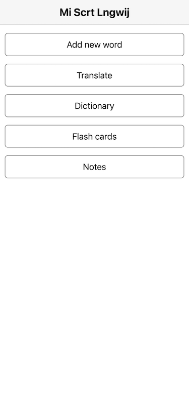
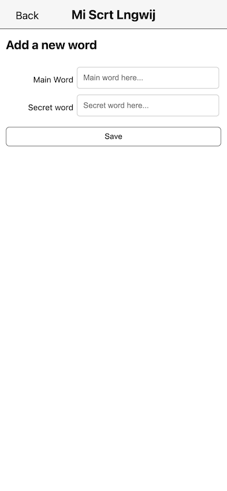
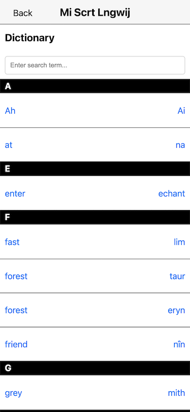
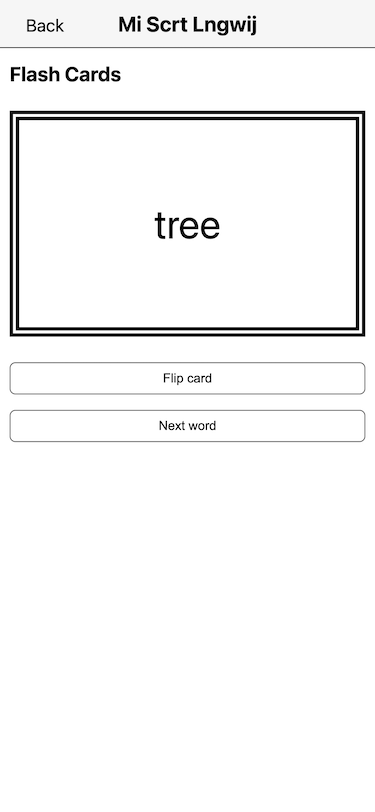
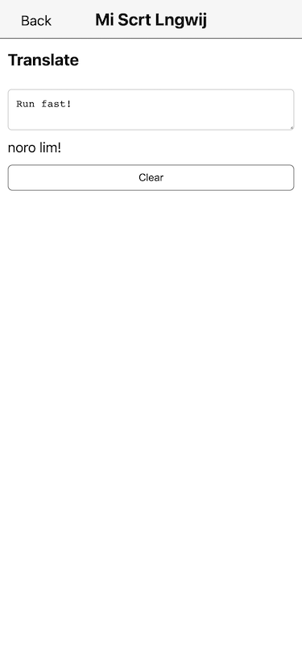
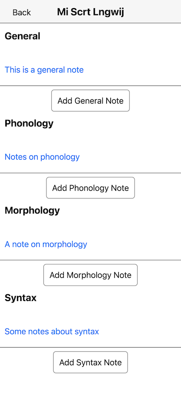

# My Secret Language

Create your own secret language!

A single page JavaScript application built with [React](https://reactjs.org) using [Next.js](https://nextjs.org/). The My Secret Language app uses the Local Storage API for storing your dictionary of words. It uses function components and React hooks.

See the app in action at [my-secret-language.vercel.app](https://my-secret-language.vercel.app/).

## Tech Stack

- [React](https://reactjs.org/): For the User Interface
- [Next.js](https://nextjs.org): A React framework for client and server rendering, routing, and compilation and bundling
- [TypeScript](https://www.typescriptlang.org/): Improvement over JavaScript for better editor tooling, easier maintenance, and catching bugs earlier
- [Jest](https://jestjs.io/): Unit testing framework
- [Playwright](https://playwright.dev/): End-to-end testing framework
- [CSS](https://developer.mozilla.org/en-US/docs/Learn/CSS/First_steps/What_is_CSS): Just plain old CSS
- [CircleCI](https://circleci.com/): Continuous integration platform to automate testing
- [Vercel](https://vercel.com/): Hosting platform

## Features of the app

- Add, edit, and delete new words.
- Translate sentences from your native language into your secret language.
- View all your words in your own language's dictionary.
- Study your own secret language by using the app's flashcards feature.

|         |   |  |
| :-------------------------------------------: | :-----------------------------------------: | :------------------------------------------: |
|                     Home                      |                  Add Word                   |                  Dictionary                  |
|  |  |       |
|                  Flash Cards                  |                  Translate                  |                    Notes                     |

<<<<<<< Updated upstream

## Current Development

New Feature: [User management](https://github.com/dmatthew/my-secret-language/pull/13)

Users will be able to sign up and log in to the app.

## License

=======

### Tech Stack

- [React](https://reactjs.org/): For the User Interface
- [Next.js](https://nextjs.org): React Framework for client and server rendering, routing, and compilation and bundling
- [TypeScript](https://www.typescriptlang.org/): Improvement over JavaScript for better editor tooling, easier maintenance, and catching bugs earlier
- [Jest](https://jestjs.io/): Unit testing framework
- [Playwright](https://playwright.dev/): End-to-end testing framework
- [CSS](https://developer.mozilla.org/en-US/docs/Learn/CSS/First_steps/What_is_CSS): just plain old CSS
- [iron-session](https://github.com/vvo/iron-session): JavaScript library for managing sessions
- [Postgres](https://www.postgresql.org/): Relational database for storing data

### License

> > > > > > > Stashed changes

[MIT](/LICENSE)
