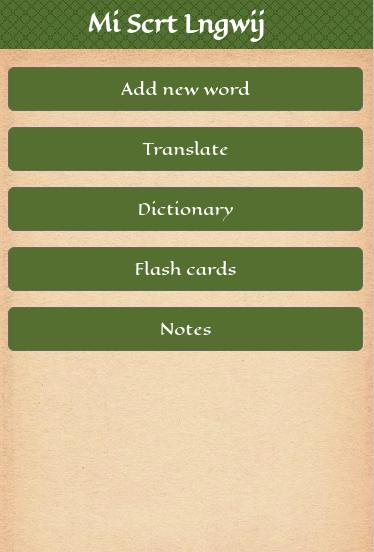

My Secret Language
==================

Create your own secret language!

Built with [React](https://reactjs.org/) v16. The My Secret Language app uses the Local Storage API so users can use the app anywhere, even offline.

### Features of the app:

* Add, edit, and delete new words.
* Translate sentences from your native language into your secret language.
* View all your words in your own language's dictionary.
* Study your own secret language by using the app's flashcards feature.
* Can be used offline when you don't have an internet connection.

### License
[MIT](/LICENSE)
